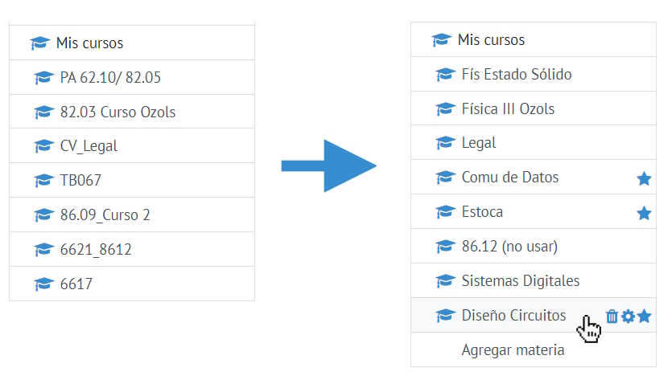

# FiubaFav ⚙

Extensión para mejorar la experiencia en el Campus FIUBA.

# Funciones

- Renombrar materias en el sidebar a un nombre personalizado
- Elegir materias "favoritas" o "activas"
- Añadir cualquier materia del campus al sidebar

# Instalación

- Descargar el proyecto como ZIP (botón verde más arriba)
- Descomprimir ZIP en una destinación permanente
- Ir al menú de extensiones del navegador (`chrome://extensions`)
- Encender modo desarollador
- Arrastrar la carpeta del proyecto al navegador

# Modificaciones adicionales
- Elimina la barra azul gigante que no sirve para nada y saca espacio

# Notas
- Toda la información se guarda en `localStorage`
- No se realizan requests a ningún servidor
